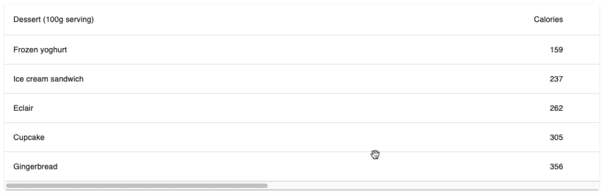

# useHorizontalScroll

useHorizontalScroll is a hook that adds the hability ti scroll horizontally by grabbing the element used as a ref.

To use it, add the scrollRef to the component you want to be scrollable and spread the props. Props has all necessary mouse events on it.

The hook accepts a parameter called scrollBehavior, where the value can be 'natural' or 'reverse', where  natural will scroll to the side the user is dragging and reverse will do the other way around.

The hook returns an object containing the scrollRefe that must be added as a ref to the element/component that you want to add the scroll behavior, the props that you need to spread on that same component, clickStartX that has the horizontal value from where the user started the scroll, scrollStartX that has the horizontal scroll value of the element, and the isDragging boolean, that syas if the user is or isn't scrolling by dragging;

## Example:

```js
export default function BasicTable() {
  const { scrollRef, props } = useHorizontalScroll("reverse");
  const classes = useStyles();

  return (
    <RootRef rootRef={scrollRef}>
      <TableContainer component={Paper} {...props}>
      ...
      </TableContainer>
    </RootRef>
```


